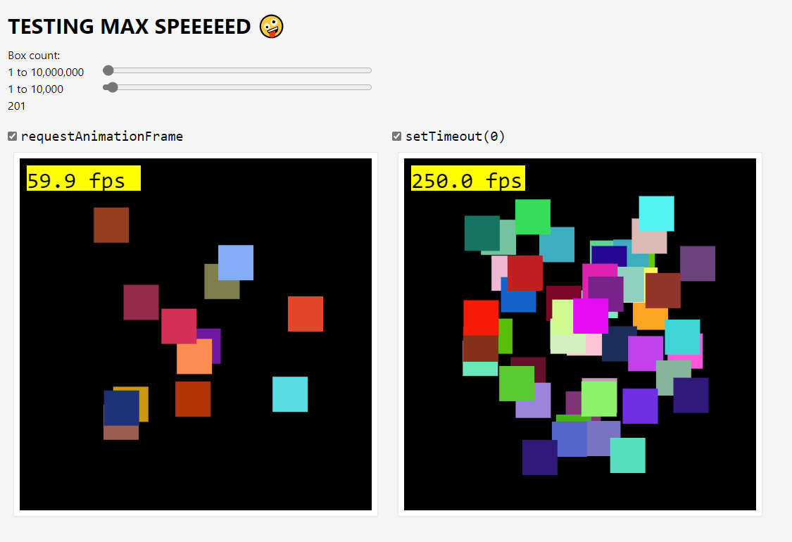

# JS Canvas Speed Experiment

In this repo, I tested rendering to the native HTML canvas element using two different methods:

- The native mechanism via calling the [`requestrequestAnimationFrame`](https://developer.mozilla.org/en-US/docs/Web/API/window/requestAnimationFrame) function add the end of the rendering function. Using this method, the `delta` is provided to the rendering function by the API
- Calling the rendering function manually, computing the delta manually and calling the function on a [`setTimeout(0)`](https://developer.mozilla.org/en-US/docs/Web/API/setTimeout)

To control how much strain I apply on the rendering loop each cycle, I use a slider that controls how many random squares we draw for each frame.

[Demo](https://gitlab.io/sachahjkl/js_canvas_experiment):

